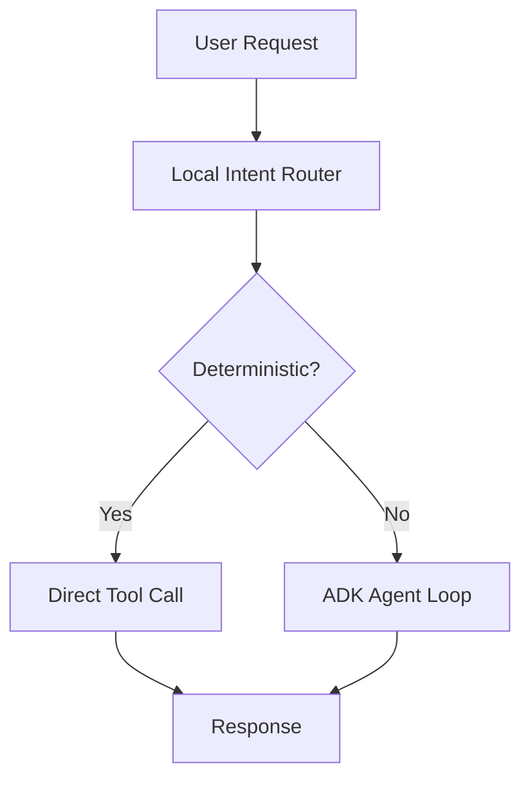

# VoltStream Agent Overview

## Purpose
The VoltStream agent is a text-only smart-home energy operator that turns user requests into safe, tool-backed actions. It uses a local intent router for deterministic commands and escalates ambiguous or complex requests to a Google ADK (Agent Development Kit) tool-using agent.

## What Is An Agent (Basics)
An agent is a system that can:
- Interpret a user goal expressed in natural language.
- Decide which tools to use to accomplish that goal.
- Execute tools and use their outputs to respond.

In VoltStream, the agent does not mutate state directly. All device changes happen through registered tools, and the agent can only report changes that tools confirm.

## Agent Type Used
- Framework: Google ADK.
- Agent class: `google.adk.agents.Agent` (tool-using / function-calling agent).
- Tool wrapper: `google.adk.tools.FunctionTool`.
- Session service: `google.adk.sessions.InMemorySessionService` (ephemeral, resets on restart).
- Model: Gemini via Vertex AI when configured; default `gemini-2.5-flash`.

## Agent Loop (Basics)
The agent follows a tool-first loop:
1. PLAN: interpret the request and decide if tools are needed.
2. SELECT TOOL: choose the best tool and extract arguments.
3. EXECUTE TOOL: run the tool function.
4. OBSERVE RESULT: read tool output (success, device info, changes).
5. RESPOND: craft the final user-facing answer.

## High-Level Flow

## Key Backend Entry Points
- API endpoints: [backend/app/routers/agent.py](backend/app/routers/agent.py)
- Orchestration: [backend/app/agents/voltstream_agent.py](backend/app/agents/voltstream_agent.py)
- ADK runner and tool registration: [backend/app/agents/runner.py](backend/app/agents/runner.py)
- Prompt and rules: [backend/app/agents/prompts.py](backend/app/agents/prompts.py)

## Tools (What The Agent Can Do)
- Toggle device on or off.
- Get device status.
- List active devices.
- Calculate total consumption.
- Recommend energy saving.
- Create a device.
- Delete a device.

Tool implementations live in:
- [backend/app/tools/device_tools.py](backend/app/tools/device_tools.py)
- [backend/app/tools/energy_tools.py](backend/app/tools/energy_tools.py)

## Why This Design
- Fast and safe for simple commands (local router + direct tools).
- Flexible for complex requests (ADK reasoning + tool selection).
- Transparent results (tool outputs are captured and returned).
